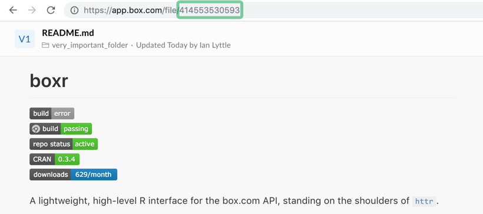
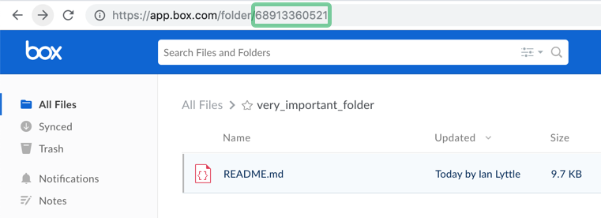

```{r setup, echo=FALSE, message=FALSE}
library("conflicted")
library("here")
library("fs")

# this is a bit of a hack - this code is at the start of *each* of the vignettes;
# I would prefer that it appear once

# We want to keep a *single* copy of the figures for the entire site. The 
# reference copy of the figures is in the package directory `man/figures`.
# The first thing we do in this vignette is to copy that directory 
# to an the `vignettes`

dir_source <- here::here("man/figures")
dir_target <- here::here("vignettes")
dir_target_figures <- file.path(dir_target, "figures")

if (dir_exists(dir_target_figures)) {
  dir_delete(dir_target_figures)
}

dir_copy(dir_source, dir_target)
```

## Authentication

The Box API is programatically accessed by user created apps and `boxr` supports two classes of these apps:

- [OAuth2](auth-oauth2.html) - Straight forward browser based authentication, good for most users.
- [JWT](auth-jwt.html) - Private key based authentication for use on remote machines, these carry elevated admin abilities.

To learn more about what makes these two classes different and the security consideration that go along with them read the [Apps](box-apps.html) vignette.

## Basic operations

Functions that operate on Box files or folders have arguments: `file_id` or `dir_id`. You can use the [box.com](https://box.com) web interface to find these values. Although they look like numbers, it is perhaps simpler to think of them as character strings:





Here are a few of this package's functions: 

* `box_dl(file_id)` and `box_ul(file = 'path/to/file')` to download and upload files 
* `box_setwd()`/`box_getwd()` to get/set a default box folder
* `box_load()`/`box_save()` for remote R workspaces
* `box_read()` to read files straight into R (e.g. CSV or Excel files as `data.frame`)
* `box_source()` to read and execute remote code
* `box_write()` to write R objects to Box files
* `box_search()` to query files stored on Box
* `box_add_description()` add text descriptions to your Box files 

### Directory-wide operations

Cloud storage services can complement version control systems for code, which aren't well suited to large binary files (e.g. databases, .RData, or heaps of pdfs). box explicitly versions binary files, keeping old ones, and making it easy fall back to an older copy.

boxr provides *git style* facilities to upload, download, and synchronize the contents of entire local and remote directories. At the time of writing, the box.com API does not support this directly, and so boxr recursively loops through directory structures.


* `box_push()` will update the remote directory with new/changed local files
* `box_fetch()` will update the local directory with new/changed remote files

These functions all have `overwrite` and `delete` parameters, which are set to `FALSE` by default.

**Disclaimer:** box.com is no replacement for a VCS/remote-database, and familiar verbs are no guarantee of expected behavior! Do check the function documentation before jumping in.

### Piping

boxr's functions have been designed to be 'pipable'. Here's a little example:

```r
library(boxr)
library(dplyr)
library(magrittr)

# 'nycflights13.json' is the same as nycflights13::flights, if you want to
# follow along at home

box_auth()

box_search("nycflights13.json") %>%                # Find a remote file
  box_read() %>%                                   # Download it as a data.frame
    group_by(origin, dest, month) %>%              #   Do some, er, cutting edge
    summarise(mu = mean(arr_delay), n = n()) %>%   #   analysis with dplyr!
  box_write("delay_summary.xlsx") %>%              # Convert to .xlsx, upload
  box_add_description("Check out these averages!") # Add a description to your file!

```

## Reporting Bugs

If you find anything that looks like a bug while using it, please report it using a GitHub issue:
<https://github.com/r-box/boxr/issues>.
